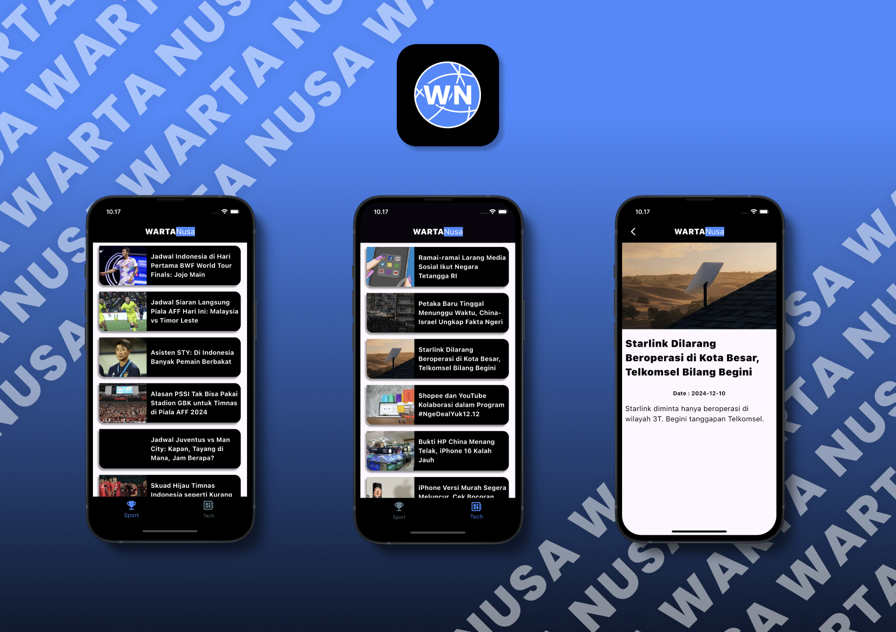

# Warta Nusa 📰  
Your go-to news app for everything sports and tech in Indonesia!  

## 📖 About  
**Warta Nusa** is a Flutter-based news app that keeps you updated on the latest in sports and technology. Whether you're a sports enthusiast or a tech geek, Warta Nusa has you covered! Powered by the **Berita Indo API**, this app delivers fresh and relevant news right to your fingertips.  

## ✨ Features  
- 🏅 **Sports Section**: Stay in the know with the latest updates in the sports world.  
- 💻 **Tech Section**: Catch up on groundbreaking innovations and tech trends.  
- 🌟 Sleek, modern UI for a seamless reading experience.  
- 🚀 Built with Flutter for smooth performance across devices.  

## 🛠️ Technology Stack  
- **Framework**: Flutter  
- **Backend**: Berita Indo API  
- **State Management**: Flutter's built-in tools  

## 🔧 Installation  

1. Clone this repository:  
   ```bash  
   git clone https://github.com/yourusername/warta-nusa.git  

## 📸 Screenshots  

Here’s a sneak peek at what you can expect:  

  